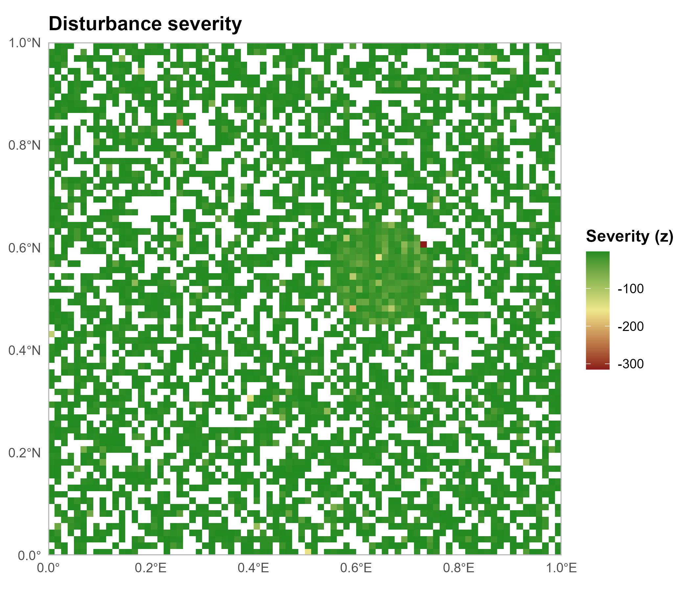
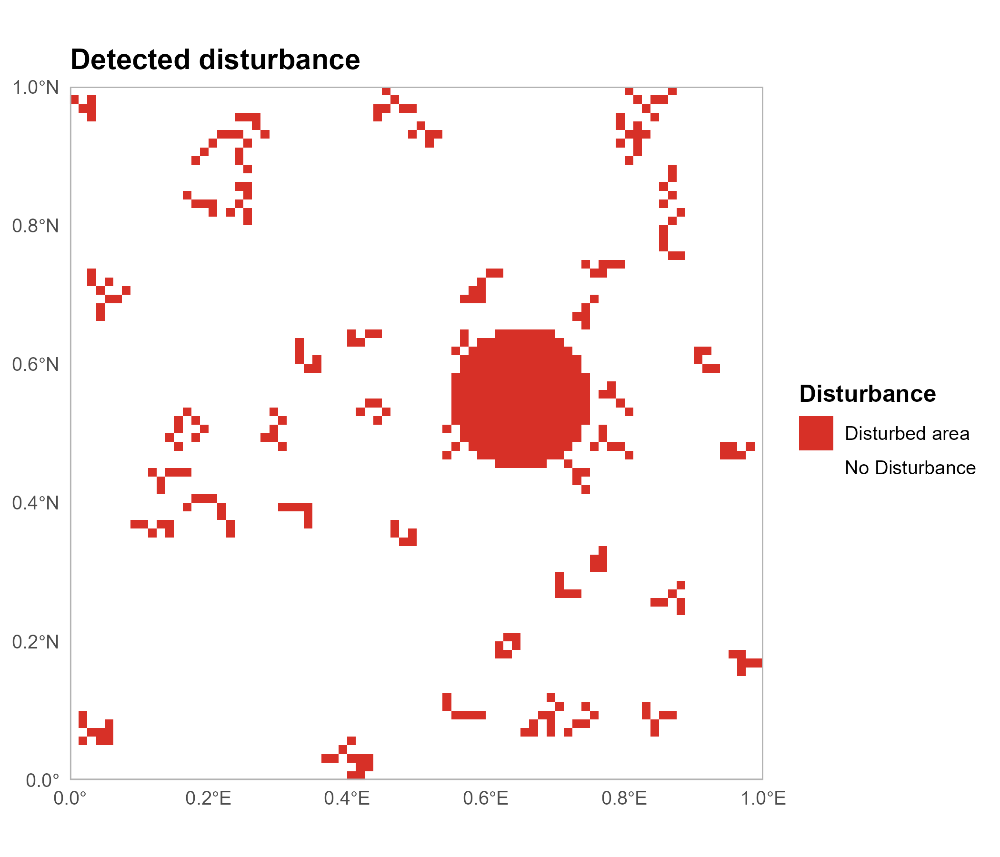
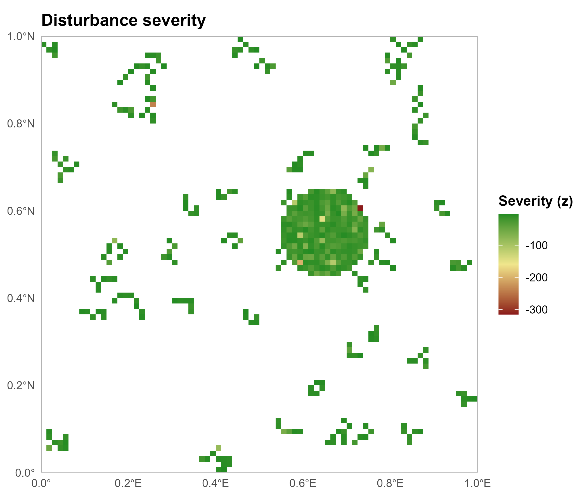
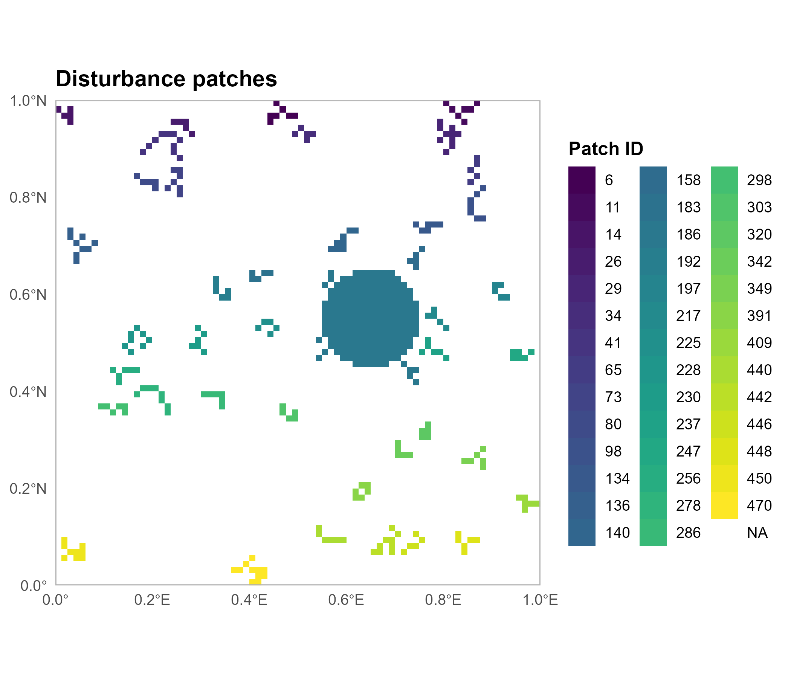
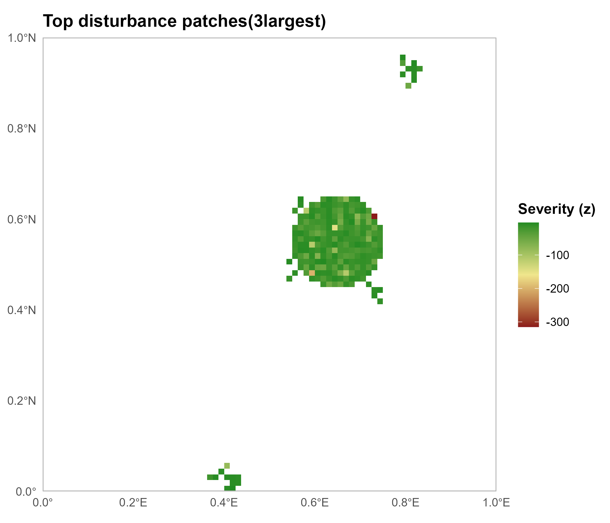

# refoRest 

refoRest provides tools to detect, analyze and map disturbance patterns in remote sensing index time series.
The package implements a reproducible workflow for disturbance detection using z-scores, spatial patch delineation and automated generation of maps and summary outputs.

---

## Key Features

Designed for raster time series data (e.g. NDVI), the package provides functions to:

- Detect disturbance events using z-score based methods 
- Apply robust statistics (median / MAD) to reduce sensitivity to outliers
- Identify spatially connected disturbance patches
- Compute patch-level metrics (area, severity, timing)
- Generate disturbance maps using `ggplot2`
- Produce automated outputs including maps, tables and reports


## Usage

Users can detect and analyze disturbance dynamics in forest time series, making it ideal for applications in sustainable forest management and forest monitoring.


## Requirements

This package requires the following R packages:

- `sf`
- `terra`
- `ggplot2`
- `scales`
- `utils`

---

## Installation
From GitHub

```r
# List of required packages
packages <- c("sf", "terra", "ggplot2", "scales", "utils")

# Check which packages are missing
missing_packages <- packages[!(packages %in% installed.packages()[,"Package"])]

# Install only missing packages
if (length(missing_packages) > 0) {
  install.packages(missing_packages)
} else {
  message("All packages are already installed!")
}

remotes::install_github("anna-hehn/refoRest")
```

## EXAMPLE: Detecting Forest Disturbances within a Time Series

```r
library(refoRest)

# Load example data
ex <- get_example_data()

# Read and clip the local NDVI time series
x <- get_index_local(
  aoi   = ex$aoi,
  files = ex$files,
  dates = ex$dates
)

# Run the full workflow
# This creates  a disturbance detection result, patch metrics, four disturbance maps, 
# a CSV table with patch statistics and a text report
res <- create_map_and_report(
  x = x,
  aoi = ex$aoi,
  baseline = 1:5,
  z_thresh = -3,
  direction = "drop",
  min_duration = 2,
  robust = TRUE,
  min_spread = 0,
  min_patch_cells = 5,
  top_n = 3,
  output_dir = "disturbance_output"
)
```

---

## Detailed Explanation

### `get_example_data()`
```r
library(refoRest)

# Load example dataset
ex <- get_example_data()

# Inspect structure
str(ex)

# List of 3
#  $ aoi  : sf object with polygon geometry
#  $ files: chr [1:10] "ndvi_*.tif"
#  $ dates: Date [1:10] "2023-01-01" ...
```
This function loads the synthetic example dataset included in the package.

### Output
- `aoi`: an `sf` polygon defining the Area of Interest
- `files`: character vector of NDVI raster file paths
- `dates`: `Date` vector corresponding to the raster layers


### `get_index_local()`
```r
x <- get_index_local(
  aoi   = ex$aoi,
  files = ex$files,
  dates = ex$dates
)
```
This function reads a time series of raster files and clips them to a given AOI.
The processing involves reading the rasters into a multi-layer `SpatRaster`, converting the AOI to a `terra` vector,
cropping and masking the data to the AOI and assigning layer names based on the provided dates.

### Arguments

| Argument | Description                                      |
|----------|--------------------------------------------------|
| `aoi`    | `sf` polygon (Area of Interest)                  |
| `files`  | Character vector of raster file paths            |
| `dates`  | `Date` vector matching the raster files          |

### Processing steps
- Reads raster files into a multi-layer `SpatRaster`
- Converts the AOI to a `terra` vector
- Crops and masks the raster to the AOI
- Assigns layer names based on the provided dates
  
### Output
- A `terra::SpatRaster` with one layer per date


### `detect_disturbance_z()`
```r
dz <- detect_disturbance_z(
  x = x,
  baseline = 1:5,
  z_thresh = -2,
  direction = "drop",
  min_duration = 1,
  robust = TRUE,
  min_spread = 0
)

# > dz$summary
# $method
# [1] "median/MAD z-score"
# $direction
# [1] "drop"
# $z_thresh
# [1] -2
# $baseline
# [1] 1 2 3 4 5
# $post_idx
# [1]  6  7  8  9 10
# $post_names
# [1] "2023-01-06" "2023-01-07" "2023-01-08" "2023-01-09" "2023-01-10"
# $disturbed_pixels
# [1] 3863
# $total_pixels
# [1] 6400
# $disturbed_percent
# [1] 60.35938
```
This function detects disturbances from a raster time series using z-scores relative to a baseline period, which describes the core step of the workflow.

**Interpretation**:
Disturbance is defined as a statistically significant deviation from a baseline period.
Negative z-scores indicate a decrease in the index (e.g. vegetation loss), while positive values indicate an increase.
The chosen threshold directly controls the sensitivity of the detection.

### Key Concepts
- Baseline statistics are computed per pixel
- Disturbance is defined as deviation from baseline
- Supports both decreases ("drop") and increases

### Arguments

| Argument       | Description                                                                 |
|----------------|-----------------------------------------------------------------------------|
| `x`            | Raster time series (`SpatRaster`)                                          |
| `baseline`     | Defines the reference period used to estimate normal conditions. <br> A stable and representative baseline is crucial for meaningful disturbance detection. |
| `z_thresh`     | Controls how strong a deviation must be to be classified as disturbance. <br> More extreme values lead to fewer but more certain detections. |
| `direction`    | `"drop"` or `"rise"`                                                       |
| `min_duration` | Reduces false positives by requiring disturbances to persist over multiple time steps. |
| `robust`       | Use median/MAD instead of mean/sd                                          |
| `min_spread`   | Lower bound for variability                                                |

### Outputs
- `disturbance`: binary disturbance mask
- `first_idx`: first detection index per pixel
- `severity`: most extreme z-score in the post-baseline period
- `summary`: method and result overview

Using the provided example dataset, the disturbance detection identified that approximately 60% of the pixels were classified as disturbed.  
This indicates a spatially extensive disturbance event affecting a large proportion of the study area.


### `patch_metrics()`
```r
pm <- patch_metrics(
  disturbance = dz$disturbance,
  severity = dz$severity,
  first_idx = dz$first_idx,
  directions = 8,
  min_patch_cells = 1,
  return_polygons = TRUE
)

# > head(pm$patch_table)
#   patch_id n_cells    area_m2     area_ha severity_mean severity_min severity_max first_idx_min perimeter_m shape_index
# 1        1    3843 7390849800 739084.9800     -7.413320  -314.980871    -2.002078             1 8473140.904   27.803042
# 2       13      10   19230221   1923.0221     -4.465262    -7.649750    -2.016222             1   30517.346    1.963133
# 3       46       6   11539755   1153.9755     -4.320562    -6.792175    -2.556390             1   19443.650    1.614636
# 4       18       2    3846110    384.6110    -18.314864   -33.629177    -3.000550             1   11094.001    1.595778
# 5       24       1    1923119    192.3119     -3.087750    -3.087750    -3.087750             1    5547.092    1.128385
# 6        9       1    1923011    192.3011    -27.694537   -27.694537   -27.694537             3    5546.937    1.128385
```
This function groups disturbed pixels into spatial patches and computes patch-level metrics.
The processing pipeline of this function converts the disturbance raster into a binary mask, identifies spatially connected
components (patches), filters them based on a minimum size threshold and computes spatial metrics for each remaining patch.
Disturbance patches represent spatially contiguous areas of affected pixels and allow the transition from pixel-based detection
to landscape-level analysis. Patch metrics such as area and shape provide insights into the spatial structure and extent of 
disturbances, which are relevant for ecological interpretation and management decisions.

### Arguments

| Argument             | Description                                                                 |
|----------------------|-----------------------------------------------------------------------------|
| `disturbance`        | Binary disturbance raster                                                   |
| `severity`           | Optional raster representing disturbance intensity per pixel. <br> If provided, summary statistics (e.g. mean, min, max) are calculated per patch to quantify disturbance magnitude. |
| `first_idx`          | Optional raster indicating the first time step at which disturbance was detected. <br> This allows temporal characterization of patches, such as identifying when disturbances occurred. |
| `directions`         | Defines how neighbouring pixels are considered connected (4 or 8 neighbours). <br> Using 8-direction connectivity results in more aggregated patches, while 4-direction connectivity leads to more fragmented patch structures. |
| `min_patch_cells`    | Minimum number of connected pixels required to retain a patch. <br> This parameter helps to remove small, potentially noisy detections and focuses the analysis on spatially meaningful disturbance events. |
| `return_polygons`    | Return patch polygons                                                       |

### Outputs

- `patch_id`: SpatRaster with unique patch IDs
- `patch_table`: Data frame with one row per patch and associated metrics
- `patch_polygons`: Optional polygon representation of patches

### Typical metrics

- number of cells per patch
- area (m² and hectares)
- severity statistics (mean, min, max)
- first detection index
- perimeter and shape index


### `map_disturbance()`

```r
p <- map_disturbance(
  patch_id = pm$patch_id,
  severity = dz$severity,
  aoi = ex$aoi,
  title = "Disturbance severity"
)

p
```
This function generates spatial visualizations of disturbance patterns using `ggplot2`. 
It includes transforming raster data into a plot-compatible format, supporting multiple visualization modes, 
enabling AOI overlays and providing flexible styling and export options.
However, the function focuses on translating analytical outputs into spatially explicit representations that facilitate intuitive assessment 
of disturbance patterns, where different map types emphasize complementary aspects such as presence, spatial configuration and intensity. By prioritizing 
larger patches the identification of dominant disturbance processes at the landscape scale is facilitated.

### Arguments

| Argument    | Description                                                                 |
|-------------|-----------------------------------------------------------------------------|
| `patch_id`  | SpatRaster with patch IDs                                                   |
| `severity`  | Optional raster representing disturbance intensity                          |
| `aoi`       | Optional boundary layer for spatial reference                               |
| `top_n`     | Number of largest patches to display                                        |
| `show`      | Controls whether presence or patch IDs are visualized                       |

### Example Map

The example below illustrates the output of `map_disturbance()` when visualizing disturbance severity.  
By providing the `severity` raster, the function generates a map in which disturbance intensity is represented using z-scores.



The resulting map highlights where disturbances are strongest within the study area.  
It demonstrates how `map_disturbance()` translates analytical outputs into spatially explicit visualizations, enabling an intuitive interpretation of disturbance intensity patterns.


### `create_map_and_report`

```r
res <- create_map_and_report(
  x = x,
  aoi = ex$aoi,
  baseline = 1:5,
  z_thresh = -3,
  direction = "drop",
  min_duration = 2,
  robust = TRUE,
  min_spread = 0,
  min_patch_cells = 5,
  top_n = 3,
  output_dir = "disturbance_output"
)
```
This function integrates the full disturbance analysis into a single reproducible pipeline.
It detects disturbances using `detect_disturbance_z`, delineates spatial patches via `patch_metrics`, generates map outputs
with `map_disturbance()` and exports results including maps, patch metrics and a summary report.
By unifying all processing steps, it ensures methodological consistency across detection, spatial aggregation
and visualization, while reducing user complexity and enabling efficient reporting.

### Arguments

| Argument | Description |
|----------|-------------|
| x | Raster time series (`SpatRaster`) with one layer per time step. |
| aoi | Optional Area of Interest for map overlay (no effect on analysis). |
| baseline | Reference period used to estimate normal conditions. |
| z_thresh | Threshold defining how strong a deviation must be to detect disturbance. |
| direction | Detects decreases (`"drop"`) or increases (`"rise"`) in the time series. |
| min_duration | Minimum number of consecutive time steps required for disturbance detection. |
| robust | Uses median/MAD instead of mean/sd for more robust statistics. |
| min_spread | Lower bound for variability to avoid extreme z-scores. |
| directions | Pixel connectivity (4 or 8 neighbours) for patch delineation. |
| min_patch_cells | Minimum patch size to remove small, noisy detections. |
| return_polygons | Returns patch geometries as polygons if TRUE. |
| top_n | Number of largest patches shown in the top-patches map. |
| color settings | Controls map colors and visual appearance. |
| layout options | Controls titles, borders, transparency, and layout. |
| output_dir | Directory for saving output files. |
| save_maps | Saves maps as image files if TRUE. |
| save_patch_table | Saves patch metrics as CSV if TRUE. |
| save_report | Saves a text-based report if TRUE. |

### Example Maps
The following maps represent the outputs of the full disturbance analysis workflow and illustrate different aspects of the detected disturbance patterns.

#### **1) Detected Disturbance**
This map shows the spatial distribution of pixels classified as disturbed based on deviations from baseline conditions.
It represents the binary outcome of the disturbance detection step and provides a clear overview of where disturbances occurred within the study area.


#### **2) Disturbance Severity (Z-Score)**
This map visualizes the intensity of disturbances using z-scores, indicating how strongly each pixel deviates from baseline conditions.
More extreme values highlight areas of pronounced disturbance and allow differentiation between weak and strong disturbance signals.


#### **3) Disturbance Patches (IDs)**
This map groups disturbed pixels into spatially connected patches, assigning a unique identification to each patch.
It enables the transition from pixel-based detection to spatial analysis of disturbance structure and extent.


#### **4) Top Disturbance Patches (Top 3)**
This map highlights the largest disturbance patches, focusing on the most spatially dominant disturbance events.
By prioritizing large patches, it facilitates the identification of major disturbance processes at the landscape scale.


### Output

- `detection`: Output from disturbance detection
- `patches`: Patch metrics and spatial representation
- `maps`: List of generated `ggplot2`maps
- `files`: File paths of exported outputs

### Generates files

The workflow automatically exports the following outputs to the specified directory:
- disturbance presence map
- patch ID map
- severity map
- top-patches map
- patch metrics table (CSV)
- text-based disturbance report
